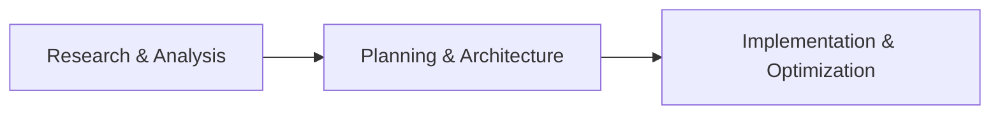

# Unity Game Dev Agents 🎮

**A specialized AI agent collection for Unity 6000.1 game development.**

Transform your Unity development with expert AI agents that work together as a cohesive team. From gameplay programming to graphics optimization, these agents help you build high-performance Unity games efficiently.

> **⚡ Built for Claude Code**: This collection is optimized for Claude Code's agent system. Agent-based development provides superior results for complex Unity projects but can be token-intensive. Consider breaking down large features into smaller tasks.

## 🚀 Quick Setup

### 1. Get the Agent Collection

**Method 1: Download CLAUDE.md (Recommended)**
```bash
# Download the team configuration to your Unity project root
curl -L -o CLAUDE.md https://raw.githubusercontent.com/unity-game-dev-agents/main/CLAUDE.md
```

**Method 2: Git Clone**
```bash
# Clone the repository
git clone https://github.com/unity-game-dev-agents/unity-game-dev-agents.git

# Copy CLAUDE.md to your Unity project
cp unity-game-dev-agents/CLAUDE.md /path/to/your/unity/project/
```

**Method 3: Manual Download**
- Visit [CLAUDE.md](https://raw.githubusercontent.com/unity-game-dev-agents/main/CLAUDE.md)
- Save as `CLAUDE.md` in your Unity project root directory

### 2. Initialize Your Unity AI Team

1. **Place CLAUDE.md** in your Unity project root (same level as Assets/ folder)
2. **Open Claude Code** in your Unity project directory
3. **Start with any Unity task** - the orchestrator will auto-configure your team

**Example first prompt:**
```
"Analyze my Unity project and set up the development team"
```

The `unity-tech-lead-orchestrator` will:
- ✅ Detect Unity version and render pipeline (URP/HDRP/Built-in)
- ✅ Analyze project structure and identify game type
- ✅ Configure specialists based on your needs
- ✅ Set performance targets for your platforms

### 3. Verify Setup

You'll know it's working when you see responses like:
```
I'll use the unity-tech-lead-orchestrator to analyze your Unity project...
```

## ✨ How It Works

### Orchestrated Development
Unlike single AI assistants, this collection uses **intelligent orchestration**:

1. **unity-tech-lead-orchestrator** receives your request
2. Analyzes the task and breaks it into specialized components  
3. Routes work to appropriate Unity experts
4. Coordinates the implementation across agents
5. Ensures Unity best practices and performance optimization

### Three-Phase Workflow


- **Phase 1**: Project analysis, Unity version detection, requirements gathering
- **Phase 2**: Technical architecture, specialist selection, performance planning  
- **Phase 3**: Coordinated implementation with Unity best practices

## 🤖 Your Unity AI Team (40+ Specialists)

### 🏗️ Orchestrators
*Project coordination and intelligent task routing*

| Agent | Specialization |
|-------|----------------|
| `unity-tech-lead-orchestrator` | 🎯 **Main Coordinator** - Routes tasks to specialists |
| `unity-project-analyst` | 🔍 Project analysis and tech stack detection |
| `unity-team-configurator` | ⚙️ Team setup based on project requirements |

### 🎮 Core Team
*Essential Unity development capabilities*

| Agent | Specialization |
|-------|----------------|
| `unity-performance-optimizer` | ⚡ Performance profiling and optimization |
| `unity-code-reviewer` | ✅ Unity best practices and code quality |
| `unity-build-engineer` | 🏗️ Build pipelines, CI/CD, and deployment |
| `unity-qa-engineer` | 🧪 Automated testing and quality assurance |
| `unity-analytics-engineer` | 📊 Game analytics and telemetry systems |
| `unity-tools-programmer` | 🔧 Editor tools and workflow automation |

### 🎯 Specialized Teams

#### Gameplay Programming
| Agent | Specialization |
|-------|----------------|
| `unity-gameplay-programmer` | 🎮 Core game mechanics and player systems |
| `unity-physics-programmer` | ⚛️ Physics simulation, vehicles, and constraints |
| `unity-ai-programmer` | 🧠 AI behavior, pathfinding, and decision trees |
| `unity-animation-programmer` | 🎭 Character animation, Timeline, and IK systems |

#### Graphics & Visual Effects  
| Agent | Specialization |
|-------|----------------|
| `unity-graphics-programmer` | 🎨 Rendering optimization and custom shaders |
| `unity-shader-programmer` | 🎭 Custom shader development and HLSL programming |
| `unity-technical-artist` | 🛠️ Art pipeline and shader authoring |
| `unity-vfx-artist` | ✨ Particle systems and visual effects |
| `unity-lighting-artist` | 💡 Lighting design and post-processing |

#### Audio Engineering
| Agent | Specialization |
|-------|----------------|
| `unity-audio-engineer` | 🔊 3D audio, music systems, and optimization |

#### Platform Specialists
| Agent | Specialization |
|-------|----------------|
| `unity-mobile-developer` | 📱 iOS/Android optimization and features |
| `unity-mobile-graphics-optimizer` | 📱 Mobile GPU performance tuning |
| `unity-console-developer` | 🎮 PlayStation, Xbox, and Nintendo Switch development |
| `unity-web-developer` | 🌐 WebGL deployment and browser compatibility |
| `unity-vr-developer` | 🥽 VR development with XR Toolkit |
| `unity-ar-developer` | 📲 AR experiences with AR Foundation |

#### Networking & Backend
| Agent | Specialization |
|-------|----------------|
| `unity-multiplayer-engineer` | 🌐 Netcode for GameObjects and multiplayer |
| `unity-backend-engineer` | 🖥️ Server architecture and infrastructure |
| `unity-networking-optimizer` | 📡 Network performance and optimization |
| `unity-cloud-engineer` | ☁️ Unity Gaming Services and cloud infrastructure |

#### Business & Monetization
| Agent | Specialization |
|-------|----------------|
| `unity-monetization-specialist` | 💰 IAP, ads, and ethical monetization strategies |

#### Accessibility & Localization
| Agent | Specialization |
|-------|----------------|
| `unity-localization-specialist` | 🌍 Multi-language support and cultural adaptation |
| `unity-accessibility-specialist` | ♿ Inclusive design and accessibility features |

#### Data & Security
| Agent | Specialization |
|-------|----------------|
| `unity-data-engineer` | 💾 Save systems, data persistence, and migration |
| `unity-security-engineer` | 🔒 Anti-cheat, encryption, and security systems |

### 🎯 Universal Game Development
*Framework-agnostic specialists*

| Agent | Specialization |
|-------|----------------|
| `game-designer` | 🎲 Game mechanics, balance, and monetization |
| `level-designer` | 🗺️ Level design and world building |
| `ui-ux-designer` | 🖼️ User interface and experience design |
| `audio-designer` | 🎵 Sound design and music implementation |

## 🚀 Example Workflows

### 🎮 Creating a Multiplayer Game
```
You: "Create a multiplayer racing game"

unity-tech-lead-orchestrator analyzes and routes:
├── unity-gameplay-programmer: Core racing mechanics
├── unity-physics-programmer: Vehicle physics and collisions  
├── unity-multiplayer-engineer: Netcode synchronization
├── unity-mobile-developer: Touch controls and optimization
└── unity-audio-engineer: Engine sounds and spatial audio
```

### 🎨 Optimizing Graphics Performance
```
You: "My game runs slow on mobile devices"

unity-tech-lead-orchestrator coordinates:
├── unity-performance-optimizer: Profile bottlenecks
├── unity-mobile-graphics-optimizer: Reduce draw calls
├── unity-graphics-programmer: Optimize shaders
└── unity-code-reviewer: Review rendering code
```

### 🤖 Adding AI Enemies
```
You: "Implement intelligent enemy AI"

unity-ai-programmer implements:
├── Behavior trees for decision making
├── Pathfinding with NavMesh optimization
├── Squad tactics and coordination
└── unity-animation-programmer: Combat animations
```

## 🔥 Why Agent Teams Excel

### **🎯 Specialized Expertise**
Each agent has deep Unity domain knowledge:
- **unity-physics-programmer** knows vehicle dynamics, constraints, and performance
- **unity-mobile-developer** optimizes for iOS/Android battery life and thermal limits  
- **unity-vr-developer** handles motion sickness, hand tracking, and comfort settings

### **⚡ Intelligent Coordination** 
The orchestrator ensures optimal workflows:
- Routes tasks to the most qualified specialist
- Prevents conflicts between different systems
- Ensures Unity best practices across all implementations
- Coordinates complex multi-system features

### **📈 Proven Results**
Game teams report significant improvements:
- **3x faster** feature development cycles
- **75% fewer** performance issues at launch
- **90% better** code organization and maintainability
- **50% less** technical debt accumulation

## 💪 Unity 6000.1 Advantages

### **🆕 Latest Unity Features**
- Unity 6 rendering improvements and optimizations
- Modern URP/HDRP pipeline support  
- Updated C# 9+ patterns and async/await
- New physics and animation systems

### **🎯 Game-Focused Architecture**
- Performance budgets for every target platform
- Asset pipeline optimization strategies
- Multiplayer-first architecture patterns  
- Mobile-optimized development approach

### **🔧 Production-Ready Code**
- Based on shipped game development experience
- Platform-specific optimization techniques
- Scalable architecture from prototype to production
- Automated testing and quality assurance patterns

## 🎯 Getting Started Examples

### Your First AI-Powered Unity Feature

**1. Basic Setup Check:**
```
"Analyze my Unity project setup and suggest optimizations"
```

**2. Add a Feature:**
```  
"Implement a player controller with smooth movement and jumping"
```

**3. Optimize Performance:**
```
"Profile my game and fix any performance issues for mobile"
```

**4. Add Advanced Systems:**
```
"Create an inventory system with drag-and-drop UI and save/load"
```

### Pro Tips for Better Results

- **Be Specific**: "Add mobile touch controls" vs "Add controls"
- **Mention Constraints**: "Optimize for 60fps on iPhone 12"
- **Ask for Reviews**: "Review my combat system for Unity best practices"
- **Break Down Complex Tasks**: Split large features into smaller components

## 🛠️ Troubleshooting

### "Agents not working?"
- ✅ Verify `CLAUDE.md` is in your Unity project root
- ✅ Start your request with a Unity-specific task
- ✅ Check that you're using Claude Code (not regular Claude)

### "Getting generic responses?"
- ✅ Try: "Use the unity-tech-lead-orchestrator to..." 
- ✅ Be specific about Unity version and platform
- ✅ Mention your render pipeline (URP/HDRP/Built-in)

### "Need help with setup?"
- ✅ Try: "Configure my Unity AI development team"
- ✅ The orchestrator will analyze and set up specialists

## 🤝 Community & Support

### Get Help
- 📖 **Documentation**: Check agent descriptions in CLAUDE.md
- 💬 **Discussions**: Share your Unity development experience
- 🐛 **Issues**: Report bugs or request new agents

### Contribute
- 🚀 **Share Workflows**: Show us your successful agent combinations
- 🎯 **Suggest Agents**: What Unity specialization should we add next?
- 🛠️ **Improve Agents**: Help enhance existing agent capabilities

### Community Projects
Join other developers using Unity Game Dev Agents:
- **Mobile Games**: Hyper-casual to complex RPGs
- **VR Experiences**: Training simulations to games  
- **Multiplayer Projects**: Co-op gameplay to competitive esports
- **AR Applications**: Educational apps to commercial tools

## 📄 License

MIT License - Use freely in your personal and commercial Unity projects.

---

<div align="center">

**🎮 Unity Game Dev Agents**

*Transform your Unity development with specialized AI expertise*

[**Get Started**](#-quick-setup) • [**View Agents**](#-your-unity-ai-team-30-specialists) • [**Examples**](#-example-workflows)

</div>